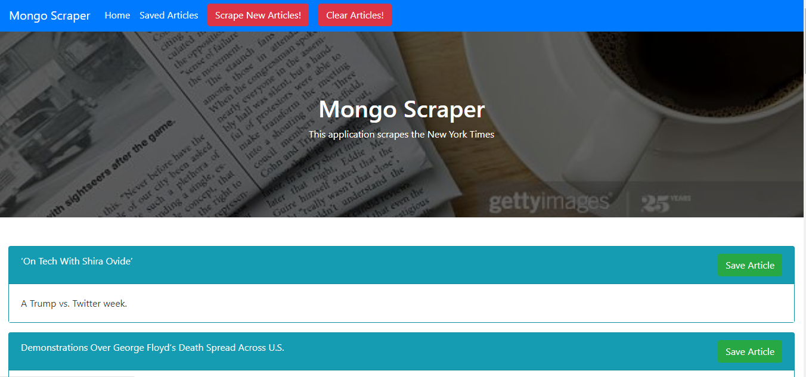

# Mongo-Scraper 

### Overview
This application uses Node, Express, Mongodb/Mongoose, Cheerio, Axios, and Express-handlebars to create a website allows the user to Scrape the NYT homepage for current articles which it will display to the userscreen.  The user will then be allowed to click a button to save a specific article which will populate in a Saved Article page.  The user can also choose to clear all the scraped articles and start again.  The user from this original page can then choose to move on to the Saved Articles page which will list any articles the user choose to save.  On this page the user can then choose to view, save, or delete notes for this article which will appear in a pop-up modal on the screen.   The user can also choose to clear all scraped articles from this page as well along with any associated notes for the articles.  All the information for the scraped articles and associated notes are saved in a local Mongodb database.  I was the sole creator of this website.

### How the application is organized
* The folder structure for the website is detailed below:
```
Mongo Scraper
├── models
│   ├── Articles.js
│   ├── index.js
│   └── Notes.js
│   
├── node_modules
│ 
├── public
│   ├── images
│   ├── js
│   │   └── index.js
│   └── styles
│       └── styles.css     
│
├── routes
│   ├── apiRoutes.js
│   └── htmlRoutes.js 
│
├── views
│   ├── layouts
│   │   └── main.handlebars 
│   ├── 404.handlebars
│   ├── index.handlebars
│   └── savedarticles.handlebars 
│
├── package-lock.json
│
├── package.json 
│   
└── server.js
```

This application uses a server.js javascript files that creates a server using express.  The routes folder holds 2 javascript files, one of which uses handlebars and mongoose to create the DOMS for the website,  and one which uses mongoose to perform CRUD commands on the database.  The models file holds the schema files for creating the associated database and collections.  The views folder holds all of the handlebars html for creating the front-end of the website.  Finally the public folder has the images, CSS, and an index.js for the creation and manipulation of the front-end of the website.


### Technologies used in the application
1.  Javascript
2.  Node
3.  Express
4.  HTML
5.  Mongodb/Monogoose
6.  Axios
7.  CSS/Bootstrap
8.  Cheerio

### Using the application
To use the application please go the deployed website below at Heroku.

  [Heroku Link](https://dry-bayou-13937.herokuapp.com/)

When you first git on the website it will take you to the home page.  Screenshot is shown below.


  

You will see a text box in which the user can input in anytype of burger they wish.  Below the text box is submit button.  Once the user enters a burger and hits the submit button the newly entered burger appears on the left side of the screen along with an associated devour button as seen below.

  

If the user decides to hit a devour button then the devour button along with its associated burger is removed from the left side of the screen and appears on the right as the burger has now been devoured.

  

### Links associated with the application
1.  Link to git hub repository for this app:  [Github Link](https://github.com/eozuna3/Mongo-Scraper)
2.  Link to deployed heroku website:  [Heroku Link](https://dry-bayou-13937.herokuapp.com/)