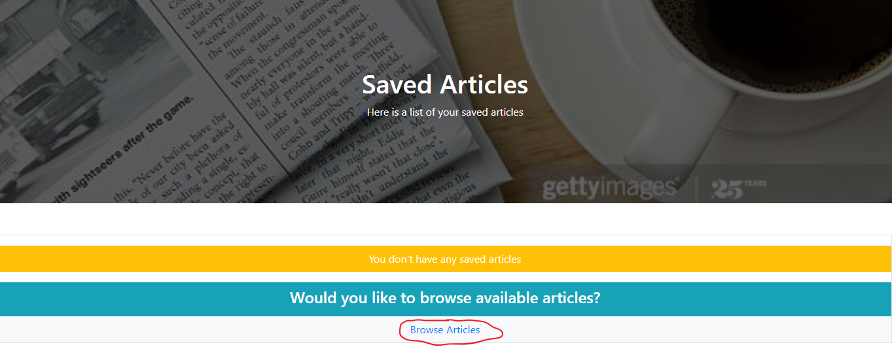

# Mongo-Scraper 

### Overview
This application uses Node, Express, Mongodb/Mongoose, Cheerio, Axios, and Express-handlebars to create a website allows the user to Scrape the NYT homepage for current articles which it will display to the userscreen.  The user will then be allowed to click a button to save a specific article which will populate in a Saved Article page.  The user can also choose to clear all the scraped articles and start again.  The user from this original page can then choose to move on to the Saved Articles page which will list any articles the user choose to save.  On this page the user can then choose to view, save, or delete notes for this article which will appear in a pop-up modal on the screen.   The user can also choose to clear all scraped articles from this page as well along with any associated notes for the articles.  All the information for the scraped articles and associated notes are saved in a local Mongodb database.  I was the sole creator of this website.

### How the application is organized
* The folder structure for the website is detailed below:
```
Mongo Scraper
├── models
│   ├── Articles.js
│   ├── index.js
│   └── Notes.js
│   
├── node_modules
│ 
├── public
│   ├── images
│   ├── js
│   │   └── index.js
│   └── styles
│       └── styles.css     
│
├── routes
│   ├── apiRoutes.js
│   └── htmlRoutes.js 
│
├── views
│   ├── layouts
│   │   └── main.handlebars 
│   ├── 404.handlebars
│   ├── index.handlebars
│   └── savedarticles.handlebars 
│
├── package-lock.json
│
├── package.json 
│   
└── server.js
```

This application uses a server.js javascript files that creates a server using express.  The routes folder holds 2 javascript files, one of which uses handlebars and mongoose to create the DOMS for the website,  and one which uses mongoose to perform CRUD commands on the database.  The models file holds the schema files for creating the associated database and collections.  The views folder holds all of the handlebars html for creating the front-end of the website.  Finally the public folder has the images, CSS, and an index.js for the creation and manipulation of the front-end of the website.


### Technologies used in the application
1.  Javascript
2.  Node
3.  Express
4.  HTML
5.  Mongodb/Monogoose
6.  Axios
7.  CSS/Bootstrap
8.  Cheerio

### Using the application
To use the application please go the deployed website below at Heroku.

  [Heroku Link](https://dry-bayou-13937.herokuapp.com/)

When you first git on the website it will take you to the home page.  Screenshot is shown below.


  

You will see a navigation bar which will have 2 links, one to the Home page and on to the Saved Articles page.  It also has 2 buttons.  The Scrape New Articles button will scrape the New York Times webpage for any available articles, unless this has already been done.  It will saved these scraped articles in a articles collection in the a mongodb and display the results to the homepage.  The clear articles button will empty the Articles collection in the mongodb along with the Notes collection.

  

If no scrape has occured the Home page will ask what action you would like to take and gives you links to either Scarpe New Articles or go to the Saved Articles.  These links are circled in red below.

  

If a scrape has occured the Home page will show a list of articles (example shown below).  The top text is the headline of the article, which is a link to the actual NYT article (circled in purple below), and also a Saved Article button which will remove the article from the list of scraped articles and move it the Saved Articles page (circled in red below). 

  

Below is an image of the Saved Article Page which has a similar navigation bar to the Home page except it lacks the Scrape New Articles button.  If any articles have been saved then a list of the Saved Articles will appear with 2 buttons to the side of each article headline.  The headlines again are links to the actual website.  The red "Delete from Saved" article button will remove the associated Saved Article from the list of Saved Articles and place it back to the list of scraped but not Saved Articles.  The purple "Article Notes" note when clicked with activate a Notes modal when pressed.

  

If there are no scraped articles then the Saved Articles page will show a link back to the home page circled in red below.

  

Below is an image of the Notes modal, which appears when the Articles note button is pressed.  The modal header shows the associated id of the selected article.  The modal body will display a list of available notes and if no notes were made then it shows an alert that no notes for this article are available.  The body also has a textarea for the user to create a new note.  Finally, the modal footer has a Save Note button which will save the text entered into the textarea into the Notes collection.

  

### Links associated with the application
1.  Link to git hub repository for this app:  [Github Link](https://github.com/eozuna3/Mongo-Scraper)
2.  Link to deployed heroku website:  [Heroku Link](https://dry-bayou-13937.herokuapp.com/)